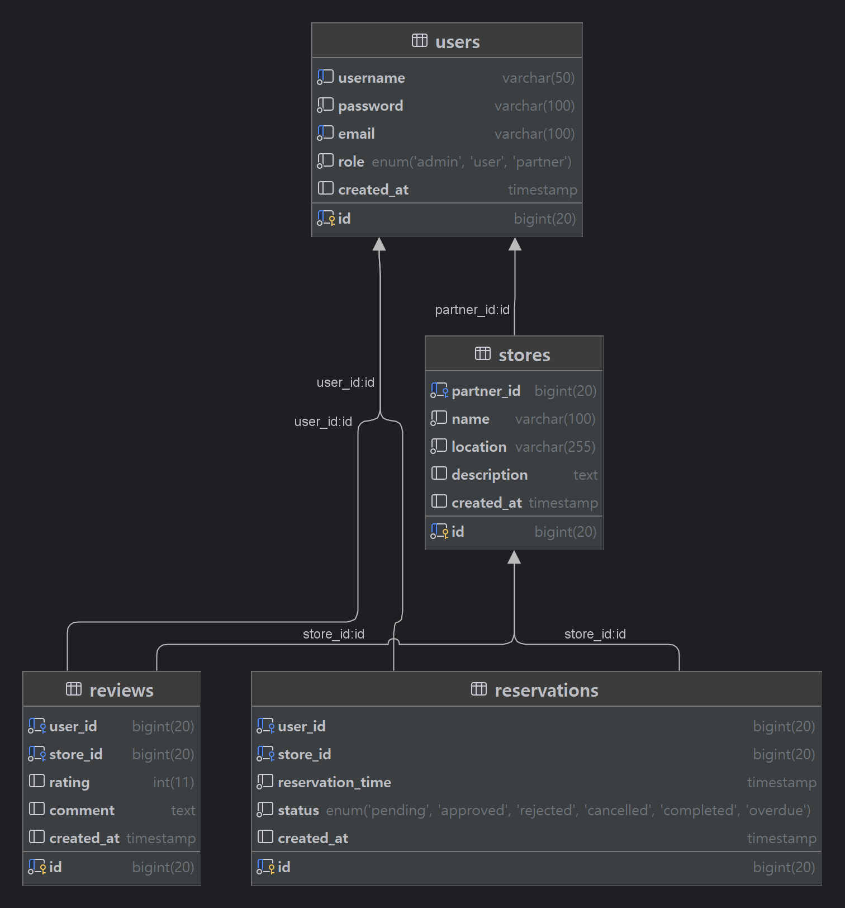

# Table Planner 서비스

## 기술 스택
- Java
- Spring Boot
- Spring Security
- Spring Data JPA
- JWT (JSON Web Token)
- ModelMapper
- Springdoc OpenAPI (Swagger)
- Lombok
- MariaDB

## ERD

## 엔드포인트

### UserController

| 권한           | 메서드 | 엔드포인트                 | 설명                |
|----------------|-------|--------------------------|---------------------|
| ROLE_USER | PUT   | /users/update            | 사용자 정보 수정     |
| ROLE_USER | POST  | /users/set-partner       | 파트너 등록         |
| ALL           | POST  | /users/register          | 회원가입            |
| Authenticated | GET   | /users/details/{username} | 사용자 상세 정보 조회 |
| Authenticated | DELETE| /users/delete            | 사용자 삭제         |

### StoreController

| 권한           | 메서드 | 엔드포인트                 | 설명                       |
|----------------|-------|--------------------------|----------------------------|
| ROLE_PARTNER | PUT   | /stores/update           | 식당 정보 수정              |
| ROLE_PARTNER | POST  | /stores/register         | 식당 등록                   |
| ALL           | GET   | /stores                  | 모든 식당 목록 조회         |
| Authenticated | GET   | /stores/detail/user/{storeId} | 사용자의 식당 상세 정보 조회 |
| ROLE_PARTNER | GET   | /stores/detail/partner/{storeId} | 파트너의 식당 상세 정보 조회 |
| ROLE_PARTNER | DELETE| /stores/withdraw         | 식당 탈퇴                   |

### ReviewController

| 권한           | 메서드 | 엔드포인트                 | 설명                           |
|----------------|-------|--------------------------|--------------------------------|
| Authenticated | PUT   | /reviews/{id}            | 리뷰 수정                     |
| Authenticated | DELETE| /reviews/{id}            | 리뷰 삭제                     |
| Authenticated | POST  | /reviews                 | 리뷰 작성                     |
| Authenticated | GET   | /reviews/user/{userId}   | 사용자가 작성한 리뷰 목록 조회 |
| ALL | GET   | /reviews/store/{storeId} | 식당 리뷰 목록 조회           |

### ReservationController

| 권한           | 메서드 | 엔드포인트                    | 설명                            |
|----------------|-------|-----------------------------|---------------------------------|
| Authenticated | PUT   | /reservations/update        | 예약 정보 수정                   |
| ROLE_PARTNER | PUT   | /reservations/approve       | 예약 승인                       |
| Authenticated | POST  | /reservations/create        | 예약 생성                       |
| ALL | GET   | /reservations/user/store/{storeId}/{date} | 특정 사용자의 특정 날짜 예약 목록 조회 |
| Authenticated | GET   | /reservations/user/reservations | 특정 사용자의 모든 예약 목록 조회   |
| ROLE_PARTNER | GET   | /reservations/store/{storeId} | 식당의 모든 예약 목록 조회         |
| Authenticated | GET   | /reservations/detail/{reservationId} | 예약 상세 정보 조회           |
| ROLE_PARTNER | GET   | /reservations/confirm/{confirmationNumber} | 예약 확인                   |
| Authenticated | DELETE| /reservations/cancel       | 예약 취소                       |

### AuthenticationController

| 권한 | 메서드 | 엔드포인트                 | 설명             |
|------|-------|--------------------------|------------------|
| ALL | POST  | /auth/login              | 로그인           |

### 참고 사항
- 모든 사용자는 식당 조회, 리뷰 조회, 예약 목록 조회를 할 수 있습니다.
- 예약을 하기 위해서는 회원가입을 하여 ROLE_USER 권한을 얻어야 합니다.
- 식당 등록, 예약 승인 등의 파트너 엔드포인트에 접근하기 위해서는 ROLE_PARTNER를 얻어야 합니다.
- ROLE_PARTNER는 ROLE_USER 권한을 가질 수 있습니다. (상위 권한)
- 식당 내 키오스크는 파트너의 계정으로 로그인되어 있으며, 손님은 예약번호를 통해 예약 확인을 할 수 있습니다.
